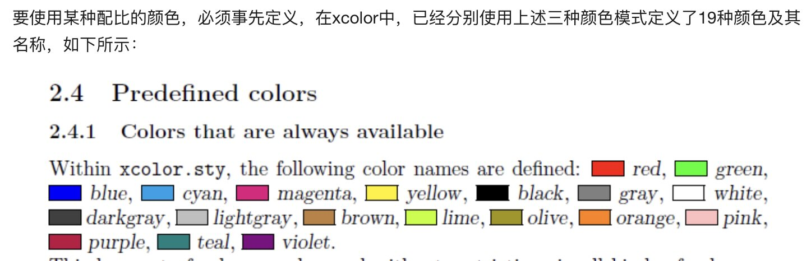

# Latex

latex 教程

[LaTeX 新手教程：从入门到日常使用](https://zhuanlan.zhihu.com/p/456055339)

## Packeage

- ctex

中文支持

- color,xcolor



- listings

代码块支持

- fancyhdr

页头、页脚

- subfigure

插入图片

- tikz-flowchart

画流程图，提供基础图形，默认白色

## 字体

```tex
\setCJKmainfont{PingFangSC-Regular}
\setmainfont{Garamond-Regular}
\setmonofont{Consolas NF}
```

Latex: $la tech$

中英文混排文档类型：`\documentclass[UTF8]{ctexart}`

## 编译

### 编译顺序

在LaTeX中，文档的编译过程通常需要多个步骤，这是因为LaTeX在处理文档时需要进行多次计算和布局，以确保所有交叉引用、目录、参考文献等都正确地显示在最终的输出文件中。

以下是LaTeX文档的常见编译顺序：

1. LaTeX编译：首先运行LaTeX编译器对源文件进行编译，生成一个DVI（Device Independent）文件。在此过程中，LaTeX将源文件中的所有命令和文本转换为可视化的输出，并生成文本样式、目录、参考文献等信息。
2. BibTeX编译：如果文档中包含参考文献引用，需要运行BibTeX编译器来处理文献数据库（.bib文件），并生成一个包含参考文献列表的BBL（BibTeX Bibliographic References）文件。
3. LaTeX编译：运行第二次LaTeX编译器，此时LaTeX将读取之前生成的BBL文件，并在文档中插入正确的参考文献引用。
4. LaTeX编译：运行第三次LaTeX编译器，此时LaTeX将正确地引用参考文献，并生成完整的目录和交叉引用，以及其他任何需要的信息。
5. PDF编译：最后一步是将DVI文件转换为PDF文件。这可以使用一个独立的程序，如dvipdfm或者使用直接的pdfLaTeX编译器来完成。

需要注意的是，有些LaTeX文档可能需要进行更多的编译步骤，特别是当文档中使用了像索引、目录等复杂结构时。此外，有些编辑器和LaTeX环境可以自动处理这些编译步骤，简化了编译过程。

### vimtex

vimtex 使用 latexmk 编译

指定编译器， 通过宏定义， 也就是在文件开头， 加上类似命令 `% !TEX program = pdflate/xelatex` - 多次编译多行指定（magic comment）

多个文件设定主文件， 通过宏定义， 加上主文件的路径， 比如 `% !TEX root = ../main.tex`

## 基本格式

```tex
\begin{document}
\part{} :部分
\chapter：章节
\section：一级章节
\subsection：二级章节
\subsubsection：三级章节
\end{document}

\textbf{加粗}
\textit{斜体}
\underline{下划线}

```

## 列表

1. 无序列表

```lua
\begin{itemize}
\item{1}
\end{itemize}
```

2. 有序列表

```lua
\begin{enumerate}
\item{1}
\end{enumerate}
```

3. 描述列表

```tex
\begin{description}
\item[无序列表] 无编号的列表
\item[有序列表] 带编号的列表
\item[描述列表] 带标签的列表
\end{description}
```

## 代码块（listings)

- style

```tex
% code style
\lstset{
     basicstyle.     =    \ttfamily ,             % use mono font
     numbers         =    left,                   % where to put the line-numbers
     numberstyle     =    \zihao{-5},             % 行号的样式，小五号，tt等宽字体
     tabsize.        =.   4,                      % sets default tabsize to 2 spaces
     backgroundcolor =    \color{white},          % choose the background color. You must add \usepackage{color}
     %
     language        =    Python,                 % the language of the code
     keywordstyle    =    \color[RGB]{40,40,255}, % keyword style
     stringstyle     =    \color{magenta},        % string styl
     commentstyle    =    \color[RGB]{192,44,56}, % comment style
     frame.          =    shadowbox/single,
     rulesepcolor    =    \color{red!20!green!20!blue!20},%代码块边框为淡青色
}
```

- code

```latex
\begin{lstlisting}
print ("Hello world")
print ("Hello world")
print ("Hello world")
#this is comments
print ("Hello world")
print ("Hello world")
print ("Hello world")
if true:
    print("true")
\end{lstlisting}

```

- 自定义代码高亮

```tex
documentclass{ctexart}
\usepackage{listings}
\usepackage{xcolor}
% 定义可能使用到的颜色
\definecolor{CPPLight}  {HTML} {686868}
\definecolor{CPPSteel}  {HTML} {888888}
\definecolor{CPPDark}   {HTML} {262626}
\definecolor{CPPBlue}   {HTML} {4172A3}
\definecolor{CPPGreen}  {HTML} {487818}
\definecolor{CPPBrown}  {HTML} {A07040}
\definecolor{CPPRed}    {HTML} {AD4D3A}
\definecolor{CPPViolet} {HTML} {7040A0}
\definecolor{CPPGray}  {HTML} {B8B8B8}
\lstset{
    columns=fixed,
    numbers=left,                                        % 在左侧显示行号
    frame=none,                                          % 不显示背景边框
    backgroundcolor=\color[RGB]{245,245,244},            % 设定背景颜色
    keywordstyle=\color[RGB]{40,40,255},                 % 设定关键字颜色
    numberstyle=\footnotesize\color{darkgray},           % 设定行号格式
    commentstyle=\it\color[RGB]{0,96,96},                % 设置代码注释的格式
    stringstyle=\rmfamily\slshape\color[RGB]{128,0,0},   % 设置字符串格式
    showstringspaces=false,                              % 不显示字符串中的空格
    language=c++,                                        % 设置语言
    morekeywords={int,signed,typename,break,double,long,sizeoffor,public,throw,std},
    emph={map,set,multimap,vector,string,list,deque,array,stack,forwared_list,functional,bing,numeric,},
    emphstyle=\color{CPPViolet},
}
\begin{document}
{\setmainfont{Courier New Bold}                          % 设置代码字体
\begin{lstlisting}
#include <iostream>
#include <array>
int main()
{
    constexpr int MAX = 100;
    std::array<int, MAX> arr;
}
\end{lstlisting}}
\end{document}
```

## Color

```tex
\usepackage{xeCJK}
\usepackage{mathpazo}
\usepackage{color,xcolor}

%predefined color---black, blue, brown, cyan, darkgray, gray, green, lightgray,lime, magenta, olive, orange, pink, purple, red, teal, violet, white, yellow.

\definecolor{light-gray}{gray}{0.95}    % 1.灰度
\definecolor{orange}{rgb}{1,0.5,0}      % 2.rgb
\definecolor{orange}{RGB}{255,127,0}    % 3.RGB
\definecolor{orange}{HTML}{FF7F00}      % 4.HTML
\definecolor{orange}{cmyk}{0,0.5,1,0}   % 5.cmyk
```

## 插入图片

### 基本用法

```tex
%导言区插入下面三行
\usepackage{graphicx} %插入图片的宏包
\usepackage{float} %设置图片浮动位置的宏包
\usepackage{subfigure} %插入多图时用子图显示的宏包

\begin{document}

\begin{figure}[H] %H为当前位置，!htb为忽略美学标准，htbp为浮动图形
\centering %图片居中
\includegraphics[width=0.7\textwidth]{DV_demand} %插入图片，[]中设置图片大小，{}中是图片文件名
\caption{Main name 2} %最终文档中希望显示的图片标题
\label{Fig.main2} %用于文内引用的标签
\end{figure}

\end{document}
```

### 多图横排+默认编号

```tex
%导言区插入下面三行
\usepackage{graphicx}
\usepackage{float}
\usepackage{subfigure}

\begin{document}
Figure \ref{Fig.main} has two sub figures, fig. \ref{Fig.sub.1} is the travel demand of driving auto, and fig. \ref{Fig.sub.2} is the travel demand of park-and-ride.

\begin{figure}[H]
\centering  %图片全局居中
\subfigure[name1]{
\label{Fig.sub.1}
\includegraphics[width=0.45\textwidth]{DV_demand}}
\subfigure[name2]{
\label{Fig.sub.2}
\includegraphics[width=0.45\textwidth]{P+R_demand}}
\caption{Main name}
\label{Fig.main}
\end{figure}
\end{document}
```

## 画图 Tikz

[LaTeX—Tikz 宏包入门使用教程](https://zhuanlan.zhihu.com/p/127155579)
