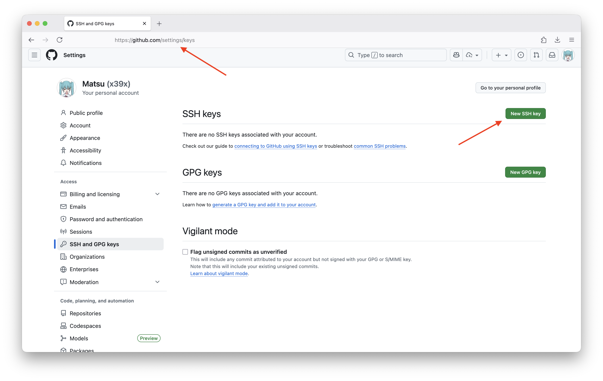

# github

## 推送本地仓库到GitHub

1. 初始化仓库
2. 添加remote

```sh
echo "# hello" >> README.md
git init
git branch -M main
git add README.md
git commit -m "first commit"
git remote add remote_name https://github.com/user/xxx.git
```

3. 关联本地与远程分支

```sh
git push --set-upstream origin main
# or
git push -u origin main
```

若没有配置ssh，需要到setting->developer setting->获取token，输入token

## 配置SSH

### 生成密钥

[参考：SSH 密钥登录及相关配置](https://x39x.cc/wiki/ssh-passkey)

```bash
cd ~/.ssh
ssh-keygen -t rsa -C xxx@xxx.com  #一路回车
```

### 添加密钥到github

```sh
# copy
vim id_rsa.pub
```



### 检验是否链接成功

```bash
ssh -T git@github.com
#出现以下则证明链接成功
"Hi lover! You've successfully authenticated, but GitHub does not provide shell access. "
```

### 错误排查

- 如果出现

```bash
git@github.com: Permission denied (publickey)
#运行代码
ssh-agent -s
ssh-add ~/.ssh/id_rsa
```

## Highlight words

> [!NOTE]  
> Highlights information that users should take into account, even when skimming.

> [!TIP]
> Optional information to help a user be more successful.

> [!IMPORTANT]  
> Crucial information necessary for users to succeed.

> [!WARNING]  
> Critical content demanding immediate user attention due to potential risks.

> [!CAUTION]
> Negative potential consequences of an action.
