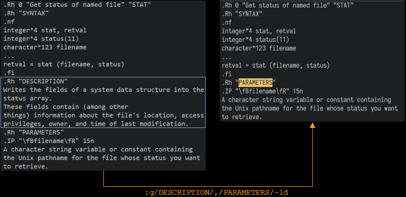

# vim 笔记

[Cheatsheet](https://github.com/skywind3000/awesome-cheatsheets)

[Cheatsheet](https://vim.rtorr.com/lang/zh_cn)

## TODO

## Global CMD

`:global` 可以简写为`:g`，可以对所有匹配到的执行操作

```sh
# 即针对在[range]范围内，所有匹配{pattern}模式的行，执行[command]命令。
:[range]g/{pattern}/[command]
# 命令:g!及其同义词:v，则可以针对所有不匹配模式的行执行操作。即针对在[range]范围内，所有不匹配{pattern}条件的行，执行[command]命令
:[range]g!/{pattern}/[command]
```

如果没有指定[range]，则针对文件中的所有行执行命令。也可以使用行地址，把全局搜索限定在指定的行或行范围内。

[pattern] 是匹配条件，也可以是一个[range]

如果没有指定[command]，则执行:print命令来显示行内容。

整个命令可以理解成，在range范围内匹配pattern的行执行Ex command

常用的Ex command：

- d 删除
- m 移动
- t 拷贝
- s 替换

```sh
# 相关帮助信息：
:h :g
:h range
:h /\@!
:help Ex-commands
```

### 基本使用

- 插入

```sh
# 在20行到200行之间，每一行下插入空行
:20,200g/^/put _
```

- 全局查找

```sh
#查找并显示文件中所有包含模式pattern的行，并移动到最后一个匹配处：
:g/pattern

#查找并显示文件中所有包含模式pattern的行：
:g/pattern/p

#查找并显示文件中所有精确匹配单词pattern的行：
:g/\<pattern\>/p

#查找并显示第20到40行之间所有包含模式pattern的行：
:20,40g/pattern/p

#查找并显示文件中所有不包行模式pattern的行，并显示这些行号：
:g!/pattern/nu
```

- 全局删除

```sh
#删除包含模式patternn的行：
:g/pattern/d

#删除不包含模式pattern的行：
:g!/pattern/d

#删除所有空行：
:g/^$/d

#删除所有空行以及仅包含空格和Tab制表符的行：
:g/^[ tab]*$/d

# 在大量删除，指定blackhole寄存器_可以避免拷贝计算提高性能
:g/pattern/d_

#删除指定范围内的文本，例如以下文本中的“DESCRIPTION”部分：
:g/DESCRIPTION/,/PARAMETERS/-1d
```



- 全局替换

```sh
# 将包含“microsoft antitrust”的行中的“judgment”替换为“ripoff”：
:g/microsoft antitrust/s/judgment/ripoff/

# 将在包含“microsoft antitrust”的前两行及后两行中进行替换：
:g/microsoft antitrust/-2,/microsoft antitrust/+2s/judgment/ripoff/c

# the best of times; the worst of times: end
# 将第1部分文字替换为“The greatest of times;”
:g/end$/s/.*of times;/The greatest of times;/
# -> The greatest of times; the worst of times: end

# 使用 :g 匹配一个范围，接着使用 s（同:% s)在这个范围内替换
# 即在匹配行后添加文字
:g/pattern/s/$/mytext

# 将aaa替换成bbb，除非该行中有ccc或者ddd
:v/ccc\|ddd/s/aaa/bbb/g
```

- 全局移动

```sh
# 将所有的行按相反的顺序排列。其中，查找模式.*将匹配所有行，m0命令将每一行移动到0行之后：
:g/.*/m0

# 以下两条命令均可以将所有不是以数字开头的行，移动到文件末尾
:g!/^[[:digit:]]/m$
:g/^[^[:digit:]]/m$
```

- 全局复制

```sh
# 使用以下命令，可以重复每一行。其中:t或:copy为复制命令：
:g/^/t.

# 将包含模式pattern的行，复制到文件末尾：
:g/pattern/t$

# Win32编译条件提取出来，拷贝到文件末：
g/#ifdef WIN32/+1,/#else\|#endif/-1 t $
```

### 特殊技巧

- 删除偶数行

```sh
:g/^/+1 d
```

这条命令也是匹配所有行，然后隔行删除（其中+1用以定位于当前行的下一行）。 为什么是隔行呢？因为在对第一行执行+1 d命令时删除的是第二行，而第二行虽然也被标记了，但已不存在了， 因此不会执行删除第三行的命令。

也可以用:normal命令实现：

```sh
:%normal! jdd
```

% 指定整个文件，然后依次执行普通模式下的 jdd，即下移删除一行。与 global 命令不同之处在于， %normal! jdd 是按照行号顺序执行，在第一行时删除了第二行，后面的所有行号都减一， 因此在第二行执行 jdd 时删除的是原来的第四行。也就是说，global 命令是通过偶数行标记的消失实现的， 而 normal 命令是通过后续行的自动前移实现的。

- 删除奇数行

normal 命令实现：%normal! dd也同样会删除整个文件，%normal! jkdd即可删除奇数行

### global与substitute

两种思路，:g是匹配后执行操作，:s是搜索替换

```sh
# double所有行
:%s/.*/&\r&/
:g/^/t.
```

## 执行外部命令

- `:!cmd`执行命令行命令把他的stdout指向vim的消息窗口
- `:r !cmd`同样的，只是把输出pipe到你cursor的下一行
- `:w !cmd`把本buffer内容pipe到这个命令的stdin
- `:.!cmd` 把当前行pipe给cmd，再把cmd的stdout输出读回来替换掉当前行
- `:%!cmd` 同上，但是当前buffer,再把cmd的stdout输出读回来替换掉当前buffer
- `:'<'>!cmd`,同上，但是选取区域,再把cmd的stdout输出读回来替换掉所选区域

## Tips

- `Ctrl w o` ：关闭其他所以窗口
- `cc` 清空一行并在合适的缩进位置进入插入模式
- `C-g` show current buffer path

- 10% 移动到文件 10% 处
- 在空白行使用 dip 命令可以删除所有临近的空白行，viw 可以选择连续空白
- 缩进时使用 `>8j >} <ap >ap =i} ==`会方便很多
- 插入模式下，当你发现一个单词写错了，应该多用 CTRL-W 这比 `<BackSpace>` 快
- c d x 命令会自动填充寄存器 "1 到 "9 , y 命令会自动填充 "0 寄存器
- 用 v 命令选择文本时，可以用 o 掉头选择，有时很有用
- 写文章时，可以写一段代码块，然后选中后执行 :!python 代码块就会被替换成结果
- 搜索后经常使用 :nohl 来消除高亮，使用很频繁，可以 map 到 `<BackSpace>` 上
- 搜索时可以用 CTRL-R CTRL-W 插入光标下的单词，命令模式也能这么用
- 映射按键时，应该默认使用 noremap ，只有特别需要的时候使用 map
- 当你觉得做某事很低效时，你应该停下来，u u u u 然后思考正确的高效方式来完成
- 用 y复制文本后，命令模式中 CTRL-R 然后按双引号 0 可以插入之前复制内容
- 某些情况下 Vim 绘制高亮慢，滚屏刷新慢可以试试 set re=1 使用老的正则引擎
- Windows 下的 GVim 可以设置 set rop=type:directx,renmode:5 增强显示

## vim 配置文件加载规则

nvim plugin 、ftplugin、queries是在[内置runtime目录](https://github.com/neovim/neovim/blob/master/runtime)
中的对应目录加载前加载，after/plugin 、after/plugin... 是在runtime目录后加载，可以用来覆盖默认设置

:h runtimepath

:h ftplugin-overrule

- plugin autoload

这两个目录是vimscript插件使用的，其中plugin会在vim启动时加载，autoload里的函数会在调用时加载，nvim插件会用到plugin目录来提供lazy
load，autoload几乎不使用

## quickfix

localfix 就是针对某个buffer的quickfix，只能在指定buffer打开，几乎没用

使用`vimgrep options *.html / grep options *.lua`会把结果发送到quickfix窗口里

- cope : copen
- ccl : cclose
- cn : cnext ]q
- cp : cprev [q
- cdo : 给每个quickfix结果执行
- caddfile/caddbuffer/caddexpr : 加载错误信息

more see :h fuickfix

make 会把错误信息发送到quickfix，
make默认是执行make命令，可以通过makeprg设置，比如 set makeprg=go\ build，
可以在make后追加参数，比如make test 、make %

quickfix 接受错误信息的格式要通过errorformat设置

runtime/compiler里设置一些常见编译器/lint的makeprg和errorformat，可以通过compiler xxx命令启用，如compiler cargo

## nvim dap 配置

### adapter

需要为每个语言配置 adapter ，例如

```lua
dap.adapters.debugpy= {
        command = python_path,
        type = "executable",
        args = { "-m", "debugpy.adapter" },
        name = "debugpy",
}
```

adapter 是对应的调试器，配置中需要启动命令，参数，类型等等

### configurations

dap 会从 provider 中加载配置，默认dap.configurations和.vscode/launch.json

可以自定义 provider, see [:help dap](https://github.com/mfussenegger/nvim-dap/blob/5860c7c501eb428d3137ee22c522828d20cca0b3/doc/dap.txt#L1381)

configurations 里给对应adapter配置调试方式，可以指定多个

```lua
local python={}
python[#python + 1] = {
        type = "debugpy",
        name = "Launch File",
        request = "launch",
        program = debug_file,
        pythonPath = python_path,
}
dap.configurations.python = python
```

其中 type 是对应adapter的名称

### launch.json

launch.json attributes see https://code.visualstudio.com/docs/debugtest/debugging-configuration#_launchjson-attributes

每个 adapter 会提供一些扩展配置，去 adapter 文档查看，如：https://github.com/microsoft/debugpy/wiki/Debug-configuration-settings

```json
{
    "$schema": "https://raw.githubusercontent.com/mfussenegger/dapconfig-schema/master/dapconfig-schema.json",
    "version": "0.2.0",
    "configurations": [
        {
            "name": "dap name",
            "type": "adapter name",
            "request": "launch or attach",
            "mode": "debug",
            "program": "debug program",
            "console": "integratedTerminal",
            "env": {},
            "args": []
        }
    ]
}
```
